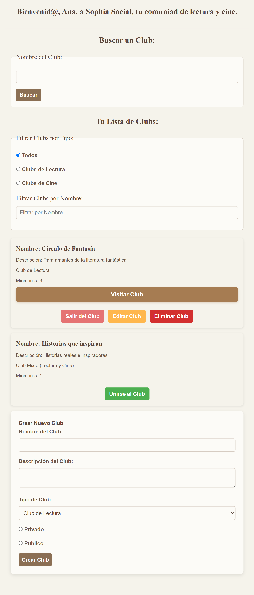
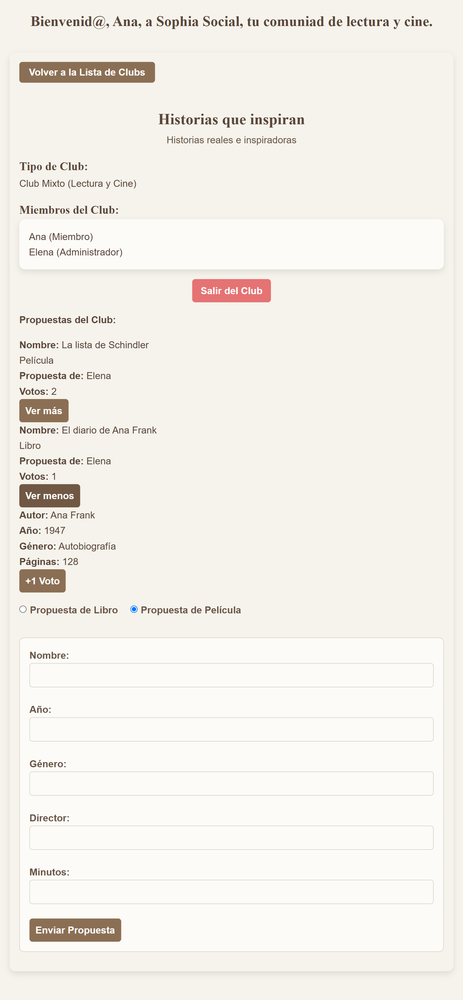

# Sophia Social

[](https://app.netlify.com/sites/sophiasocial/deploys)

## Descripción

Sophia Social es una plataforma innovadora para la creación y gestión de **clubes de lectura y cine**.  
Su objetivo es conectar a personas con intereses culturales similares permitiendo **crear clubs, proponer contenido y votar** para facilitar el diálogo y discusión sobre libros y películas.

Se puede acceder a la aplicación desde: [Sophia Social](https://sophiasocial.netlify.app/)




> **Estado del proyecto**: En desarrollo

---

## Características principales

* Crear clubes de lectura y cine.
* Gestionar la visibilidad del club (público o privado con contraseña).  
* Unirse a clubs y participar en discusiones.  
* Proponer libros o películas para leer/ver en grupo.  
* Votar por propuestas y decidir el siguiente contenido del club.  
* Gestión de miembros y administradores.  
* Autenticación de usuarios.

## Tecnologías utilizadas

* HTML
* CSS (Responsive)
* JavaScript: programación funcional, principios de SOLID, patrones de diseño
* JavaScript nativo y Lit Element como librería de componentes web
* Servidor de APIs REST con ExpressJS
* Base de datos con MongoDB (usando Atlas como servicio en la nube y Compass para visualización local)
* Despliegue en Netlify con configuración personalizada
* JSDoc para la documentación y tipado del código
* GitHub para la gestión del repositorio
* GitHooks y Linters para comprobación de errores
* Testeo con Jest

> **Tecnologías usadas durante el desarrollo que no están en la fase final**
>
> * Redux Store
> * Servidor de estáticos y servidor de APIs
> * Servidor CRUD con base de datos simulada por JSON

---

## Dependencias de la Aplicación

* Node >= 20.0.0
* Express
* MongoDB
* JSDoc
* Typescript
* Jest
* ESLint
* Lint-Staged
* StyleLint
* Netlify (para despliegue en Netlify)

## Plugins de VS

* [commitlint](https://marketplace.visualstudio.com/items?itemName=joshbolduc.commitlint)
* [Conventional Commits](https://marketplace.visualstudio.com/items?itemName=vivaxy.vscode-conventional-commits)
* [Error Lens](https://marketplace.visualstudio.com/items?itemName=usernamehw.errorlens)
* [ESLint](https://marketplace.visualstudio.com/items?itemName=dbaeumer.vscode-eslint)
* [GitHub Pull Requests](https://marketplace.visualstudio.com/items?itemName=GitHub.vscode-pull-request-github)
* [Live Preview](https://marketplace.visualstudio.com/items?itemName=ms-vscode.live-server)
* [markdownlint](https://marketplace.visualstudio.com/items?itemName=DavidAnson.vscode-markdownlint)
* [Postman](https://marketplace.visualstudio.com/items?itemName=Postman.postman-for-vscode)
* [Stylelint](https://marketplace.visualstudio.com/items?itemName=stylelint.vscode-stylelint)

## Instalación y Ejecución

Para instalar todas las dependencias necesarias, ejecuta el siguiente comando en la raíz del proyecto:

```bash
npm install
```

Para iniciar el backend con Express.js, ejecuta en el terminal el comando:

```bash
npm run server:express:start
```

Una vez iniciado, accede a la aplicación en: [http://127.0.0.1:3333](http://localhost:3333)

La aplicación utiliza un archivo .env para configurar los puertos y la conexión a la base de datos. **No incluído.** Debe ser configurado antes de la ejecución.

Se utiliza base de datos en MongoDB. El login es simulado con un sistema basado en tokens. Si un usuario se autentica, su sesión se guarda en el navegador mediante SessionStorage.

Para acceder a funconalidades avanzadas, se puede iniciar sesión con credenciales de prueba.
> El email debe seguir el formato correcto (<usuario@email.com>)

## Interfaz

La interfaz ha sido diseñada para ser responsive, utilizando:

* Flexbox y Css Grid para organizar elementos
* Media Queries para adaptar la experiencia a diferentes dispositivos
* Diseño centrado en usabilidad y accesibilidad

## Documentación

La aplicación sigue los principios de SOLID y está documentada con JSDoc.

* Se ha utilizado JSDoc para documentar funciones y componentes
* ESLint está configurado para detectar errores en el código y aplicar buenas prácticas.
* Git Hooks garantizan que el código pase validaciones antes de ser subido al repositorio.

Para generar la documentación en formato HTML, ejecuta el siguiente comando:

```bash
npm run build:docs
```

La documentación es accesible desde la carpeta ```out```

## Modelo de Datos y Relación entre Componentes

La aplicación gestiona clubs de lectura y cina con un modelo de datos basado en objetos y estructurado en MongoDB.

A continuación se detallan las clases principales y sus relaciones:

### Club

* Colección: ``clubs``
* Descripción: Representa un club de lectura, cine o mixto; donde los usuarios pueden unirse, proponer obras y votar.
* Modelo de Datos:

```text
club = {  
    "_id": "ObjectId",  
    "name": "Círculo de Lectores Fantásticos",  
    "description": "Un club para los amantes de la literatura fantástica",  
    "type": "book", (puede ser "book", "movie" o "mixed")  
    "private": false, (puede ser true = privado, o false = público)   
    "password": null, (solo en caso de club privado)  
    "admins": ["UserId1"], 
    "members": ["UserId1", "UserId2", "UserId3"],  
    "proposals": ["ProposalId1", "ProposalId2"],  
    "productCurrent": "ProductId",  
    "deadlineCurrent": "2025-03-10T00:00:00.000Z"  
}
```

* Relaciones:  
``admins`` y ``members`` almacenan Ids de usuarios (``UserId``)  
``proposals`` contiene una lista de Ids de propuestas (``ProposalId``)

>En desarrolo:  
``productCurrent`` guarda el Id del libro o película en curso (``productId``)  
``deadlineCurrent`` define la fecha límite de lectura o visionado

### Usuario

* Colección: ``users``
* Descripción: Representa un usuario registrado en la plataforma
* Modelo de Datos:

```text
user = {
  "_id": "ObjectId", 
  "name": "Javi Ribas",
  "email": "jr@email.com",
  "password": "cacatua420",
  "token": "123456" (simulación de autenticación)
  "clubs": ["ClubId1", "ClubId2"],
  "proposals": ["ProposalId1"],
  "votes": ["VoteId1", "VoteId2"],
  "products": ["ProductId1", "ProductId2"]
}
```

* Relaciones:

``clubs`` almacena los Ids de los clubs a los que pertenece el usuario  
``proposals`` contiene las propuestas que ha realizado  
``votes`` registra los votos emitidos por el usuario

> En desarrollo:  
``products`` registra los libros o películas que el usuario ha leido o visto

### Propuesta

* Colección: ``proposals``
* Descripción: Representa una propuesta de libro o película dentro de un club
* Modelo de datos:

```text
proposal = {
  "_id": "ObjectId",
  "productId": "ProductId",
  "productType": "book", (puede ser "book" o "movie")
  "userId": "UserId",
  "clubId": "ClubId",
  "votes": 5
}
```

* Relaciones:  
``productId`` referencia el Id del libro o película  
``userId`` es el usuario que hizo la propuesta  
``clubId`` indica el club en que se realizó la propuesta  
``votes`` es un contador que registra el número de votos

### Producto

* Colección: ``products`` (extendido mediante factory en ``books`` y ``movies``)
* Descripción: La colección ``products`` no existe como tal en la base de datos, sino que se divide en ``books`` y ``movies``, cada una con sus propias propiedades extendidas.
* Modelo de datos:

```text
product = {
    "_id":
    "name":  
    "year":  
    "genre":        
}

book extends product = {
    "author":  
    "pages":  
}

movie extends product = {
    "director":  
    "minutes":  
}
```

como ejemplos:

```text
book = {
  "_id": "ObjectId",
  "name": "El Hobbit",
  "year": 1937,
  "genre": "Fantasía",
  "author": "J.R.R. Tolkien",
  "pages": 310
}

movie = {
  "_id": "ObjectId",
  "name": "El Padrino",
  "year": 1972,
  "genre": "Crimen, Drama",
  "director": "Francis Ford Coppola",
  "minutes": 175
}
```

### Voto

* Colección: ``votes``
* Descripción: Registra los votos que los usuarios dan a las propuestas
* Modelo de datos:  

```text
vote = {
  "_id": "ObjectId",
  "proposalId": "ProposalId",
  "userId": "UserId"    
}
```

* Relaciones:  
``proposalId`` vincula el voto a cada propuesta  
``userId`` asegura que cada usuario solo puede emitir un único voto a una propuesta

### Sumario de Relaciones

* Cada Usuario ``users`` puede:  
Unirse a varios clubs ``clubs``  
Hacer propuestas de libros o películas ``proposals``  
Votar en propuestas de otros usuarios ``votes``  

* Cada Club ``clubs`` tiene:  
Un listado de administradores y miembros ``users``  
Una lista de propuestas de libros/películas ``proposals``  
Un producto actual en curso ``products``  

* Cada Propuesta ``proposals`` pertenece a:  
Un único club ``clubs``  
Un usuario que la creó ``users``  
Un libro o película ``products``  

* Cada Producto ``products`` puede:  
Ser un libro o una película ``books``|``movies``  
Tener múltiples propuestas asociadas en distintos clubs ``clubs``  

* Cada Voto ``votes`` registra:  
El usuario que emite el voto ``users``  
La propuesta que se vota ``proposals``

## Testeo

Utilizamos [Jest] como herramienta de testeo. Para poder ejecutar los test los hacemos por medio del comando:

```bash
npm run test:watch
```

El fichero de configuración de jest es jest.config.js

### pre-commit

Integramos [lint-staged] para ejecutar las validaciones antes de  ejecutar el commit.

```bash
#!/usr/bin/env sh

echo PRE-COMMIT GIT HOOK
npx lint-staged
```

## Agradecimientos

Aunque este proyecto haya sido un reto personal, nunca he estado solo durante el camino; y no habría sido posible sin el apoyo y el conocimiento compartido a lo largo del Bootcamp.  
Quiero agradecer a **Neoland** y su equipo por la formación y la dedicación.

En especial, al profesor [Alvaro Isorna](https://github.com/isorna) por su ilimitada paciencia.

Agradecer también a mis compañeros de curso por su apoyo y feedback. Muchas gracias a:

* [Carlos de Petronila](https://github.com/CXarlosss)
* [Julen García](https://github.com/Jotanore)
* [Javier Ribas](https://github.com/Javiribs)
* [Bryan Herrera](https://github.com/bryanprestige)

y en especial, muchas gracias al que ha sido un segundo profesor más que un compañero más:

* [Jose Ramón Carralero](https://github.com/JRamonCarralero)

También destacar a toda la comunidad de dessarrolladores, cuyo conocimiento disponible en documentación, foros y recursos abiertos ha sido clave para la resolución de problemas.

Este proyecto ha sido un gran desafío y una oportunidad de crecimiento. Agradezco a todos los que, de una manera u otra, han contribuido a hacerlo posible.
